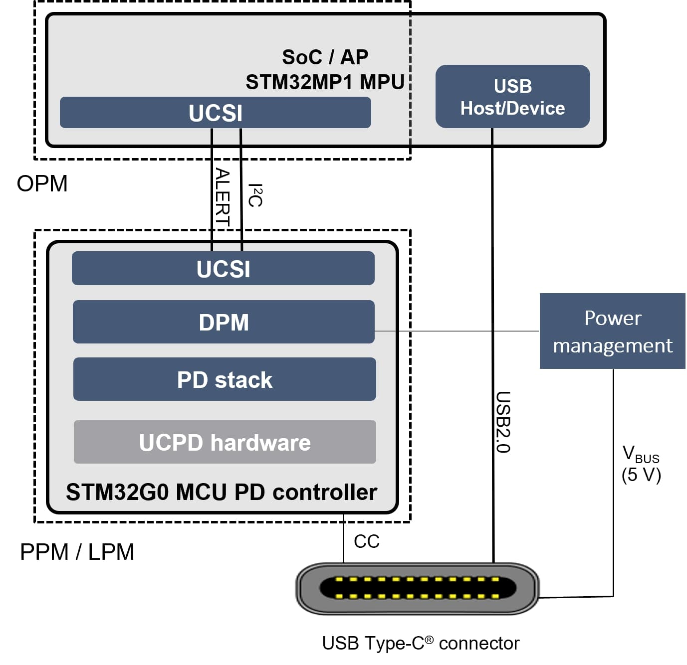

::: {.row}
::: {.col-sm-12 .col-lg-4}

# Release Notes for STM32 USB-C Power Delivery UCSI Library
Copyright &copy; 2022 STMicroelectronics\

{.logo}

# Purpose

USB Type-C Connector System Software Interface (UCSI) defines the commands and notifications to manage a platform that exposes one or more USB Type-C connectors. The combination of hardware and firmware and any vendor-provided OS software that provides this interface is referred to as the Platform Policy Manager or the PPM. UCSI PPM is typically implemented by an Embedded Controller (EC) which may either implement Power Delivery (PD) state machines or interface a PD controller. 
STMicroelectronics interfaces with STM32G0 over the I2C physical transport.

Here is an example of architecture between a STM32M135 MPU (OPM) and STM32G0 Device (PPM/LPM):

Here is the list of references to user documents:

- [ST page](https://www.st.com/en/applications/connectivity/usb-type-c-and-power-delivery.html): Key features of the new USB Type-C™ connector
- [UCSI Page](https://www.intel.com/content/dam/www/public/us/en/documents/technical-specifications/usb-type-c-ucsi-spec.pdf): USB Type-C Connector System Software Interface

:::

::: {.col-sm-12 .col-lg-8}
# Update History

::: {.collapse}
<input type="checkbox" id="collapse-section2" checked aria-hidden="true">
<label for="collapse-section2" aria-hidden="true">V1.1.0 / 06-June-2023</label>

## Main Changes

### Initial release

## Contents

  Headline
  --------
  Update for ThreadX support
  MISRA corrections
  MCUAstyle & Codespell corections

## Known limitations

## Development Toolchains and Compilers

- IAR Embedded Workbench for ARM (EWARM) toolchain V8.50.6 + ST-Link
- RealView Microcontroller Development Kit (MDK-ARM) toolchain V5.32 + ST-Link
- STM32CubeIDE [V1.9.0](https://www.st.com/en/development-tools/stm32cubeide.html) + ST-Link

## Supported Devices and boards

## Backward compatibility

NA

## Dependencies

NA

:::

::: {.collapse}
<input type="checkbox" id="collapse-section1" aria-hidden="true">
<label for="collapse-section1" aria-hidden="true">V1.0.0 / 30-June-2022</label>

## Main Changes

### Initial release

## Contents

  Headline
  --------
  Initial release

## Known limitations

## Development Toolchains and Compilers

- IAR Embedded Workbench for ARM (EWARM) toolchain V8.50.6 + ST-Link
- RealView Microcontroller Development Kit (MDK-ARM) toolchain V5.32 + ST-Link
- STM32CubeIDE [V1.9.0](https://www.st.com/en/development-tools/stm32cubeide.html) + ST-Link

## Supported Devices and boards

## Backward compatibility

NA

## Dependencies

NA

:::

:::
:::

<footer class="sticky">
For complete documentation on STM32,visit: [[www.st.com/stm32](http://www.st.com)]

This release note uses up to date web standards and, for this reason, should not be opened with Internet Explorer
but preferably with popular browsers such as Google Chrome, Mozilla Firefox, Opera or Microsoft Edge.
</footer>
